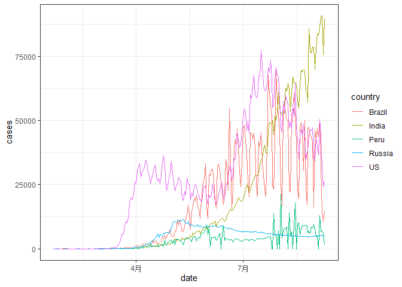

<!-- README.md is generated from README.Rmd. Please edit that file -->

# CovidYe

<!-- badges: start -->

[](https://github.com/etc5523-2020/r-package-assessment-Year-97/actions)
<!-- badges: end -->

CovidYe package is created by Chengzhi Ye, which is followed strictly by
the package-instructions. It contains one Shiny App, one data set and
three functions. The main purpose of CovidYe package is to provide the
basic information about COVID-19 of the countries with most confirmed
cases and some functions to create the interactive plots and tables
which are contains in the Shiny App.

## Installation

<!-- You can install the released version of CovidYe from [CRAN](https://CRAN.R-project.org) with: -->

<!-- ``` r -->

<!-- install.packages("CovidYe") -->

<!-- ``` -->

The development version can be installed from
[GitHub](https://github.com/etc5523-2020/r-package-assessment-Year-97)
with:

``` r
# install.packages("devtools")
devtools::install_github("etc5523-2020/r-package-assessment-Year-97")
```

## Example

### A simple presentation of coronavirus data set:

    #> # A tibble: 181,335 x 7
    #>    date       province country       lat  long type      cases
    #>    <date>     <chr>    <chr>       <dbl> <dbl> <chr>     <int>
    #>  1 2020-01-22 ""       Afghanistan  33.9  67.7 confirmed     0
    #>  2 2020-01-23 ""       Afghanistan  33.9  67.7 confirmed     0
    #>  3 2020-01-24 ""       Afghanistan  33.9  67.7 confirmed     0
    #>  4 2020-01-25 ""       Afghanistan  33.9  67.7 confirmed     0
    #>  5 2020-01-26 ""       Afghanistan  33.9  67.7 confirmed     0
    #>  6 2020-01-27 ""       Afghanistan  33.9  67.7 confirmed     0
    #>  7 2020-01-28 ""       Afghanistan  33.9  67.7 confirmed     0
    #>  8 2020-01-29 ""       Afghanistan  33.9  67.7 confirmed     0
    #>  9 2020-01-30 ""       Afghanistan  33.9  67.7 confirmed     0
    #> 10 2020-01-31 ""       Afghanistan  33.9  67.7 confirmed     0
    #> # ... with 181,325 more rows

### The Daily Situation and Cumulative Cases

    #> `summarise()` regrouping output by 'type' (override with `.groups` argument)

<table>

<thead>

<tr>

<th style="text-align:left;">

date

</th>

<th style="text-align:right;">

confirmed

</th>

<th style="text-align:right;">

death

</th>

<th style="text-align:right;">

recovered

</th>

<th style="text-align:right;">

totalconfirmed

</th>

<th style="text-align:right;">

totalrecovered

</th>

<th style="text-align:right;">

totaldeath

</th>

</tr>

</thead>

<tbody>

<tr>

<td style="text-align:left;">

2020-01-22

</td>

<td style="text-align:right;">

555

</td>

<td style="text-align:right;">

17

</td>

<td style="text-align:right;">

28

</td>

<td style="text-align:right;">

555

</td>

<td style="text-align:right;">

28

</td>

<td style="text-align:right;">

17

</td>

</tr>

<tr>

<td style="text-align:left;">

2020-01-23

</td>

<td style="text-align:right;">

99

</td>

<td style="text-align:right;">

1

</td>

<td style="text-align:right;">

2

</td>

<td style="text-align:right;">

654

</td>

<td style="text-align:right;">

30

</td>

<td style="text-align:right;">

18

</td>

</tr>

<tr>

<td style="text-align:left;">

2020-01-24

</td>

<td style="text-align:right;">

287

</td>

<td style="text-align:right;">

8

</td>

<td style="text-align:right;">

6

</td>

<td style="text-align:right;">

941

</td>

<td style="text-align:right;">

36

</td>

<td style="text-align:right;">

26

</td>

</tr>

<tr>

<td style="text-align:left;">

2020-01-25

</td>

<td style="text-align:right;">

493

</td>

<td style="text-align:right;">

16

</td>

<td style="text-align:right;">

3

</td>

<td style="text-align:right;">

1434

</td>

<td style="text-align:right;">

39

</td>

<td style="text-align:right;">

42

</td>

</tr>

<tr>

<td style="text-align:left;">

2020-01-26

</td>

<td style="text-align:right;">

684

</td>

<td style="text-align:right;">

14

</td>

<td style="text-align:right;">

13

</td>

<td style="text-align:right;">

2118

</td>

<td style="text-align:right;">

52

</td>

<td style="text-align:right;">

56

</td>

</tr>

<tr>

<td style="text-align:left;">

2020-01-27

</td>

<td style="text-align:right;">

809

</td>

<td style="text-align:right;">

26

</td>

<td style="text-align:right;">

9

</td>

<td style="text-align:right;">

2927

</td>

<td style="text-align:right;">

61

</td>

<td style="text-align:right;">

82

</td>

</tr>

<tr>

<td style="text-align:left;">

2020-01-28

</td>

<td style="text-align:right;">

2651

</td>

<td style="text-align:right;">

49

</td>

<td style="text-align:right;">

46

</td>

<td style="text-align:right;">

5578

</td>

<td style="text-align:right;">

107

</td>

<td style="text-align:right;">

131

</td>

</tr>

<tr>

<td style="text-align:left;">

2020-01-29

</td>

<td style="text-align:right;">

588

</td>

<td style="text-align:right;">

2

</td>

<td style="text-align:right;">

19

</td>

<td style="text-align:right;">

6166

</td>

<td style="text-align:right;">

126

</td>

<td style="text-align:right;">

133

</td>

</tr>

<tr>

<td style="text-align:left;">

2020-01-30

</td>

<td style="text-align:right;">

2068

</td>

<td style="text-align:right;">

38

</td>

<td style="text-align:right;">

17

</td>

<td style="text-align:right;">

8234

</td>

<td style="text-align:right;">

143

</td>

<td style="text-align:right;">

171

</td>

</tr>

<tr>

<td style="text-align:left;">

2020-01-31

</td>

<td style="text-align:right;">

1692

</td>

<td style="text-align:right;">

42

</td>

<td style="text-align:right;">

79

</td>

<td style="text-align:right;">

9926

</td>

<td style="text-align:right;">

222

</td>

<td style="text-align:right;">

213

</td>

</tr>

</tbody>

</table>

### The overall change trend of COVID-19


